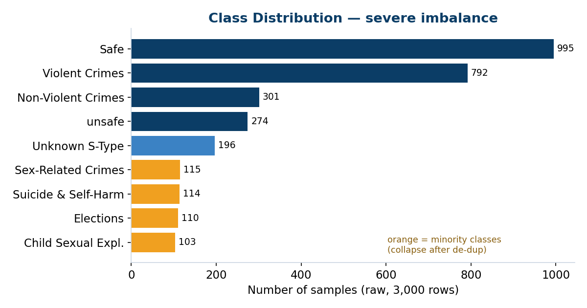
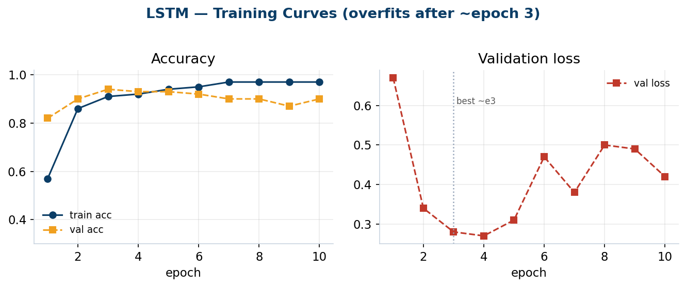
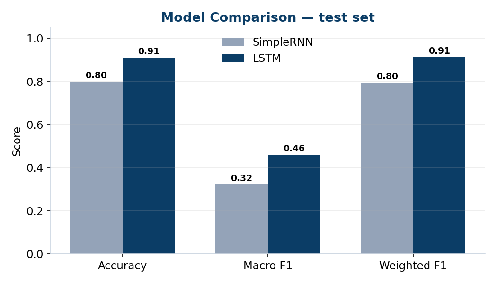
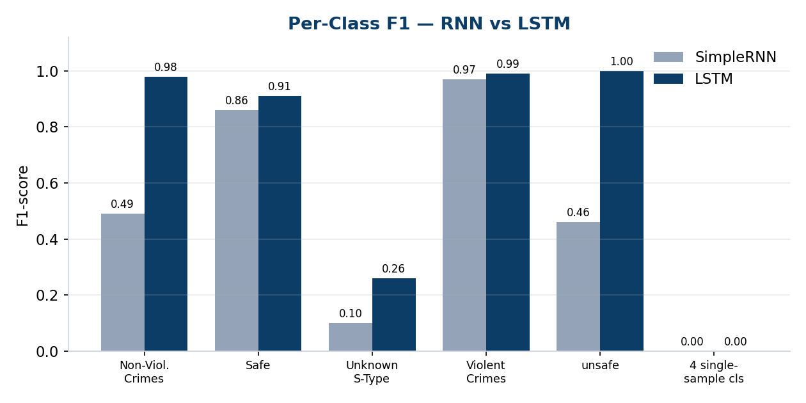

# LSTM — Toxic-Content Classification Report

**Notebook:** [`LSTM/lstm.ipynb`](../LSTM/lstm.ipynb)
**Task:** Multi-class text classification of prompts into 9 toxicity categories
**Model:** Word Embedding + `LSTM`

---

## 1. Objective

Given a user **query** and an **image description**, predict the `Toxic Category`
of the request (one of 9 classes: *Safe, Violent Crimes, Non-Violent Crimes,
unsafe, Unknown S-Type, Sex-Related Crimes, Suicide & Self-Harm, Elections,
Child Sexual Exploitation*).

This report documents the LSTM model and compares it against the SimpleRNN
baseline trained on the identical pipeline.

---

## 2. Dataset

| Property | Value |
|---|---|
| Raw rows | 3,000 |
| Columns | `query`, `image descriptions`, `Toxic Category` |
| Classes | 9 |
| Duplicate rows removed | 973 |
| Rows after de-duplication | **2,027** |

### Class balance (raw, 3,000 rows)
The data is **severely imbalanced** — two classes dominate, four are tiny:

| Class | Count | Share |
|---|---|---|
| Safe | 995 | 33.2% |
| Violent Crimes | 792 | 26.4% |
| Non-Violent Crimes | 301 | 10.0% |
| unsafe | 274 | 9.1% |
| Unknown S-Type | 196 | 6.5% |
| Sex-Related Crimes | 115 | 3.8% |
| Suicide & Self-Harm | 114 | 3.8% |
| Elections | 110 | 3.7% |
| Child Sexual Exploitation | 103 | 3.4% |

> ⚠️ **Important:** de-duplication hit the minority classes hardest. Because the
> `image descriptions` are generic and repeated, most minority-class rows were
> near-duplicates. After dropping duplicates, four classes collapse to
> **~4–5 unique rows each** — which is why they end up with **only 1 sample in
> the test set** and score 0 (see §6).



---

## 3. Preprocessing pipeline (as implemented)

Identical to the SimpleRNN pipeline:

1. **Field combination** — `query + " xxsep " + image descriptions` → `combined_text`.
2. **Text cleaning** — lowercase → strip HTML → strip URLs → expand contractions
   → remove punctuation → collapse whitespace.
3. **Vocabulary analysis** — 4,500 unique words; 54.7% are singletons; top 2,165
   words cover 95% of tokens → `VOCAB_SIZE = 2500`.
4. **Train/test split** — 80/20, **stratified**, `random_state=42`
   → **Train = 1,621**, **Test = 406**.
5. **Tokenizer** — `num_words=2500`, `oov_token="<UNK>"`, **fit on train only**.
6. **Padding** — `MAXLEN = 40`, `padding="post"`, `truncating="post"`.
7. **Label encoding** — `LabelEncoder` → integer labels (for
   `sparse_categorical_crossentropy`).

---

## 4. Model architecture

```
Embedding(input_dim=2500, output_dim=128, mask_zero=True)
LSTM(64)
Dense(32, activation="relu")
Dropout(0.5)
Dense(9, activation="softmax")
```

| Setting | Value |
|---|---|
| Loss | `sparse_categorical_crossentropy` |
| Optimizer | `adam` |
| Epochs | 10 |
| Batch size | 32 |
| Validation | `validation_split=0.2` |
| Class weighting | **Not applied** in the trained run |

**Key difference vs the RNN:** the embedding uses **`mask_zero=True`**, so the LSTM
skips the `<pad>` (index 0) positions instead of processing ~19 meaningless padded
steps per sequence.

---

## 5. Training dynamics

The LSTM **learned fast** — it reached 82% validation accuracy after a single
epoch and peaked at ~94% by epoch 3:

| Epoch | train acc | val acc | val loss |
|---|---|---|---|
| 1 | 0.57 | 0.82 | 0.67 |
| 2 | 0.86 | 0.90 | 0.34 |
| 3 | 0.91 | **0.94** | 0.28 |
| 5 | 0.94 | 0.93 | 0.31 |
| 10 | 0.97 | 0.90 | 0.42 |



Validation loss bottoms out around **epoch 3–4** and then rises while training
accuracy keeps climbing to 0.97 — a classic **overfitting** signal. An
`EarlyStopping` callback would have stopped near the epoch-3 sweet spot.

---

## 6. Results (test set, 406 rows)

| Class | Precision | Recall | F1 | Support |
|---|---|---|---|---|
| Child Sexual Exploitation | 0.00 | 0.00 | 0.00 | 1 |
| Elections | 0.00 | 0.00 | 0.00 | 1 |
| Non-Violent Crimes | 0.95 | 1.00 | 0.98 | 41 |
| Safe | 0.93 | 0.89 | 0.91 | 176 |
| Sex-Related Crimes | 0.00 | 0.00 | 0.00 | 1 |
| Suicide & Self-Harm | 0.00 | 0.00 | 0.00 | 1 |
| Unknown S-Type | 0.21 | 0.35 | 0.26 | 17 |
| Violent Crimes | 0.99 | 0.99 | 0.99 | 139 |
| unsafe | 1.00 | 1.00 | 1.00 | 29 |

| Aggregate | Score |
|---|---|
| **Accuracy** | **0.91** |
| **Macro F1** | **0.460** |
| **Weighted F1** | **0.914** |

**Reading the numbers:**
- The LSTM is **excellent on every class that has enough data**: Non-Violent
  Crimes 0.98, Violent Crimes 0.99, `unsafe` a perfect 1.00, Safe 0.91.
- The only mid-size weak spot is **Unknown S-Type** (F1 0.26) — a semantically
  fuzzy "catch-all" label that is genuinely hard.
- Macro F1 (0.46) is still held down by the four single-sample classes (each 0).
  These are a **data limitation, not a model failure**.

### Macro F1 over the 5 *learnable* classes only
Excluding the four dead single-sample classes:

- **LSTM ≈ 0.83** (vs SimpleRNN ≈ 0.58)

This is the fairest summary of true model quality on classes it could actually
learn.

---

## 7. Comparison: LSTM vs RNN

Both models share the **exact same preprocessing, split, and hyperparameters** —
the only architectural differences are the recurrent layer and `mask_zero`.

| Metric | SimpleRNN | LSTM | Δ |
|---|---|---|---|
| Test accuracy | 0.80 | **0.91** | +0.11 |
| Macro F1 | 0.322 | **0.460** | +0.138 |
| Weighted F1 | 0.795 | **0.914** | +0.119 |
| Epochs to strong val acc | ~5 | ~2 | faster |



### Per-class F1

| Class (support) | SimpleRNN | LSTM |
|---|---|---|
| Non-Violent Crimes (41) | 0.49 | **0.98** |
| Safe (176) | 0.86 | **0.91** |
| Unknown S-Type (17) | 0.10 | **0.26** |
| Violent Crimes (139) | 0.97 | **0.99** |
| unsafe (29) | 0.46 | **1.00** |
| 4 single-sample classes | 0.00 | 0.00 |



### Why the LSTM wins
- **Gated memory beats a plain recurrence.** SimpleRNN loses early-sequence
  information to vanishing gradients; the LSTM's forget/input/output gates preserve
  it across all 40 timesteps.
- The gap is largest on **medium-frequency classes** (`unsafe`: 0.46 → 1.00,
  `Non-Violent Crimes`: 0.49 → 0.98). The RNN reliably handled only the two biggest
  classes; the LSTM handled five.
- The LSTM also **converged faster** (strong at epoch 2 vs epoch 5) and to a higher
  ceiling, using `mask_zero` to avoid wasting capacity on padding.

---

## 8. Key findings & limitations

- ✅ **LSTM is the clear winner** — +11 points accuracy, +14 points macro F1, and
  near-perfect scores on every adequately-sampled class.
- ✅ Clean, leakage-free pipeline (train-only tokenizer/encoder fitting).
- ⚠️ **The ceiling is set by the data, not the model.** Four classes have only
  ~4–5 unique rows and 1 test sample each — impossible to learn or evaluate. This
  caps macro F1 regardless of architecture.
- ⚠️ **Overfitting after ~epoch 3–4** — training accuracy 0.97 vs validation 0.90.
- ⚠️ **Class weighting was not used** in the trained run.

### Recommendations
1. **Fix the minority classes** — gather more data, merge the four tiny classes
   into a coarser bucket, or drop them if out of scope. This is the single biggest
   lever for macro F1.
2. **Add `EarlyStopping(monitor="val_loss", restore_best_weights=True)`** — the
   best epoch here was ~3, not 10.
3. **Add `class_weight="balanced"`** to encourage attempts at rare classes.
4. **Report macro F1 as the primary metric**; accuracy and weighted F1 are inflated
   by the dominant Safe/Violent-Crimes classes.
5. Consider a **bidirectional LSTM** or pretrained embeddings (GloVe) as the next
   experiment once the data imbalance is addressed.

---

*Generated from the executed outputs in `LSTM/lstm.ipynb`.*
