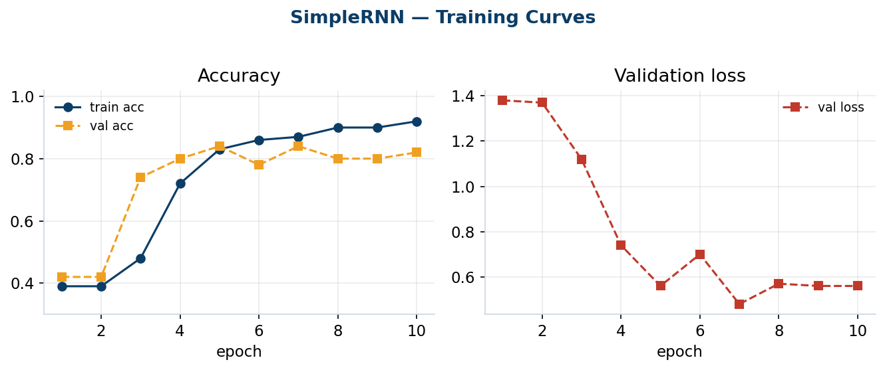

# RNN (SimpleRNN) — Toxic-Content Classification Report

**Notebook:** [`RNN/rnn.ipynb`](../RNN/rnn.ipynb)
**Task:** Multi-class text classification of prompts into 9 toxicity categories
**Model:** Word Embedding + `SimpleRNN`

---

## 1. Objective

Given a user **query** and an **image description**, predict the `Toxic Category`
of the request (one of 9 classes: *Safe, Violent Crimes, Non-Violent Crimes,
unsafe, Unknown S-Type, Sex-Related Crimes, Suicide & Self-Harm, Elections,
Child Sexual Exploitation*).

This report documents the SimpleRNN baseline and compares it against the LSTM
variant trained on the identical pipeline.

---

## 2. Dataset

| Property | Value |
|---|---|
| Raw rows | 3,000 |
| Columns | `query`, `image descriptions`, `Toxic Category` |
| Classes | 9 |
| Duplicate rows removed | 973 |
| Rows after de-duplication | **2,027** |

### Class balance (raw, 3,000 rows)
The data is **severely imbalanced**. Two classes dominate; four are tiny:

| Class | Count | Share |
|---|---|---|
| Safe | 995 | 33.2% |
| Violent Crimes | 792 | 26.4% |
| Non-Violent Crimes | 301 | 10.0% |
| unsafe | 274 | 9.1% |
| Unknown S-Type | 196 | 6.5% |
| Sex-Related Crimes | 115 | 3.8% |
| Suicide & Self-Harm | 114 | 3.8% |
| Elections | 110 | 3.7% |
| Child Sexual Exploitation | 103 | 3.4% |

> ⚠️ **Important:** de-duplication hit the minority classes hardest. Because the
> `image descriptions` are generic and repeated, most minority-class rows were
> near-duplicates. After dropping duplicates, four classes collapse to
> **~4–5 unique rows each** — which is why they end up with **only 1 sample in
> the test set** and score 0 (see §6).


---

## 3. Preprocessing pipeline (as implemented)

1. **Field combination** — `query + " xxsep " + image descriptions` into a single
   `combined_text` column. `xxsep` is a punctuation-free sentinel so it survives
   text cleaning as one token.
2. **Text cleaning** (`clean_text`): lowercase → strip HTML → strip URLs →
   expand contractions (`don't → do not`) → remove punctuation → collapse
   whitespace.
3. **Vocabulary analysis:**
   - 4,500 unique words; **2,463 (54.7%) appear only once**.
   - Cumulative coverage: the **top 2,165 words cover 95%** of all tokens.
   - → `VOCAB_SIZE = 2500` chosen (keeps the informative head, maps the rare
     tail to `<UNK>`).
4. **Train/test split** — 80/20, **stratified**, `random_state=42`
   → **Train = 1,621**, **Test = 406**.
5. **Tokenizer** — `num_words=2500`, `oov_token="<UNK>"`, **fit on training text
   only** (no test leakage). Index layout: `0 → <pad>`, `1 → <UNK>`, `2+ → words`.
6. **Padding** — `MAXLEN = 40` (95th percentile of train lengths = 37),
   `padding="post"`, `truncating="post"`.
7. **Label encoding** — `LabelEncoder` → integer labels (paired with
   `sparse_categorical_crossentropy`; no one-hot needed).

---

## 4. Model architecture

```
Embedding(input_dim=2500, output_dim=128)   # input_length=40 (deprecated arg)
SimpleRNN(64)
Dense(32, activation="relu")
Dropout(0.5)
Dense(9, activation="softmax")
```

| Setting | Value |
|---|---|
| Loss | `sparse_categorical_crossentropy` |
| Optimizer | `adam` |
| Epochs | 10 |
| Batch size | 32 |
| Validation | `validation_split=0.2` |
| Class weighting | **Not applied** in the trained run |

---

## 5. Training dynamics

The SimpleRNN was **slow to start** — it sat at ~39% accuracy (essentially
predicting the majority class) for the first two epochs before the gradients
started moving:

| Epoch | train acc | val acc | val loss |
|---|---|---|---|
| 1 | 0.39 | 0.42 | 1.38 |
| 2 | 0.39 | 0.42 | 1.37 |
| 3 | 0.48 | 0.74 | 1.12 |
| 5 | 0.83 | 0.84 | 0.56 |
| 10 | 0.92 | 0.82 | 0.56 |



The rising gap between train (0.92) and val (0.82) accuracy in later epochs shows
the model beginning to **overfit** — expected given only 1,621 training rows.

---

## 6. Results (test set, 406 rows)

| Class | Precision | Recall | F1 | Support |
|---|---|---|---|---|
| Child Sexual Exploitation | 0.00 | 0.00 | 0.00 | 1 |
| Elections | 0.00 | 0.00 | 0.00 | 1 |
| Non-Violent Crimes | 0.67 | 0.39 | 0.49 | 41 |
| Safe | 0.82 | 0.91 | 0.86 | 176 |
| Sex-Related Crimes | 0.00 | 0.00 | 0.00 | 1 |
| Suicide & Self-Harm | 0.00 | 0.00 | 0.00 | 1 |
| Unknown S-Type | 0.09 | 0.12 | 0.10 | 17 |
| Violent Crimes | 0.98 | 0.97 | 0.97 | 139 |
| unsafe | 0.48 | 0.45 | 0.46 | 29 |

| Aggregate | Score |
|---|---|
| **Accuracy** | **0.80** |
| **Macro F1** | **0.322** |
| **Weighted F1** | **0.795** |

**Reading the numbers:**
- The model is **strong on the well-represented classes** (Violent Crimes F1 0.97,
  Safe 0.86) and **weak/dead on the rare ones**.
- Macro F1 (0.32) is dragged down by the four classes with a single test sample —
  each scores 0, contributing 4 zeros to the 9-class average.
- Weighted F1 (0.79) reflects the "real-world" performance where big classes count
  more, matching the accuracy of 0.80.

---

## 7. Comparison: RNN vs LSTM

Both models share the **exact same preprocessing, split, and hyperparameters** —
the only difference is the recurrent layer (`SimpleRNN(64)` vs `LSTM(64)`, plus
`mask_zero=True` on the LSTM embedding).

| Metric | SimpleRNN | LSTM | Δ |
|---|---|---|---|
| Test accuracy | 0.80 | **0.91** | +0.11 |
| Macro F1 | 0.322 | **0.460** | +0.138 |
| Weighted F1 | 0.795 | **0.914** | +0.119 |


### Per-class F1

| Class (support) | SimpleRNN | LSTM |
|---|---|---|
| Non-Violent Crimes (41) | 0.49 | **0.98** |
| Safe (176) | 0.86 | **0.91** |
| Unknown S-Type (17) | 0.10 | **0.26** |
| Violent Crimes (139) | 0.97 | **0.99** |
| unsafe (29) | 0.46 | **1.00** |
| 4 single-sample classes | 0.00 | 0.00 |


### Macro F1 over the 5 *learnable* classes only
Excluding the four dead single-sample classes gives a fairer head-to-head:

- **SimpleRNN:** ≈ 0.58
- **LSTM:** ≈ 0.83

### Why the LSTM wins
- **SimpleRNN suffers from vanishing gradients** on longer sequences (here up to
  40 tokens), so it struggles to connect early query words to the label. Its slow
  2-epoch "dead start" is a symptom of this.
- **LSTM's gates (input/forget/output)** carry information across the whole
  sequence, letting it separate the mid-size classes (`unsafe`, `Non-Violent
  Crimes`) that the RNN confuses.
- The biggest gains are exactly on the **medium-frequency classes** — the RNN
  could only handle the two largest classes reliably, while the LSTM handled five.

---

## 8. Key findings & limitations

- ✅ The pipeline is clean: train-only tokenizer/encoder fitting, principled
  vocab and `MAXLEN` selection, no leakage.
- ✅ **LSTM clearly beats SimpleRNN** on every aggregate metric — the intended
  lesson of the RNN-vs-LSTM comparison.
- ⚠️ **The headline bottleneck is data, not architecture.** Four classes have too
  few unique samples to learn or even evaluate (1 test row each). No model can fix
  this — it needs a data fix.
- ⚠️ **Class weighting was not used** in the trained run. Adding
  `class_weight="balanced"` would push both models to attempt the minority classes
  instead of ignoring them.

### Recommendations
1. **Fix the minority classes** — collect more data, merge the tiny classes into a
   coarser label (e.g. a single "Other/Rare-harm" bucket), or drop them if out of
   scope. This will move macro F1 far more than any model change.
2. **Add `class_weight="balanced"`** to `model.fit(...)`.
3. **Report macro F1 as the primary metric** (accuracy/weighted F1 are inflated by
   the two dominant classes).
4. Optionally add `EarlyStopping(monitor="val_loss")` to curb the late-epoch
   overfitting seen in both models.

---

*Generated from the executed outputs in `RNN/rnn.ipynb`.*
